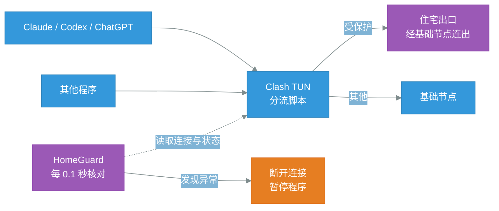

<p align="center">
  
  
  
  
  <a href="https://linux.do"></a>
</p>

# HomeGuard

让 Claude、Codex、ChatGPT 的流量**只从住宅出口出去**：一旦有连接没走住宅 IP，立即断开，并暂停这些程序，线路恢复后自动继续。

核心目标是**实时守护，环境存在异常时立即断开并暂停程序**。

> 基于 [zzusec/CheckClaude](https://github.com/zzusec/CheckClaude) 二次开发。


## 一、功能说明

| 页面 | 用途 |
| --- | --- |
| 守护 | 总状态、出口一致性、守护条件、各程序的进程与连接、最近记录 |
| 流量 | 受保护程序的实时连接，蓝色为住宅出口，可手动断开；拦截记录 |
| 体检 | 出口、DNS、本机、浏览器、出口稳定性打分【仅供参考】 |
| 分流脚本 | 一键复制 Clash 全局扩展脚本，并检查是否已经生效 |
| 设置 | 守护开关、拦截时是否暂停程序、受保护的程序与网站、Clash 连接（连不上时自动查找控制接口） |

**出口一致性**：系统时区、出口时区，以及国内、国外、谷歌侧三个视角看到的出口 IP。

**浏览器检测**：在默认浏览器里检测 WebRTC 泄露、浏览器时区与语言、区域、渲染器、平台，结果并入体检。首次使用做一次即可，不参与拦截。

**默认受保护的程序**：Claude 桌面端、Claude Code、Codex（CLI 与桌面端）、ChatGPT 桌面端。默认受保护的网站：Anthropic、Claude、OpenAI、ChatGPT。都可以在设置里改。

关闭窗口后守护仍在后台运行，在「设置 → 关于」里退出。

### 界面

**守护总览**：线路状态、出口一致性、守护条件


**流量**：受保护程序的实时连接与出口


**体检**：分组打分，含浏览器侧检测


**分流脚本**：一键复制，显示是否已生效


## 二、工作流程



两道防线：

- **分流脚本（零延迟）**：Clash 按程序路径和域名，把受保护的流量只送到「住宅出口」，其他流量走「基础节点」；
- **实时守护**：通过 Clash 控制接口每 0.1 秒核对全部连接，路由一变化立即检查。下面任一项不满足，就断开全部受保护的连接并暂停程序（SIGSTOP，暂停后不收发任何数据）：
  - Clash 运行中、TUN 开启，IPv4 与 IPv6 都经过 TUN；
  - Clash 开启了按程序识别；
  - 「住宅出口」选的是住宅代理，不是机场节点或直连；
  - 出口国家在 Claude 服务范围内；
  - 没有受保护的连接走了别的出口。出现这种情况会锁定拦截，确认处理后手动恢复。

分流脚本同时处理了防泄露：DNS 查询全程加密并按规则走代理，IPv6 由 TUN 接管，只有本机、局域网、Tailscale 组网内部、微信不经过代理。

### 拦截的时效

正常情况下，受保护的流量只能走住宅出口，不存在空档。只有规则被破坏时（「住宅出口」被切走、规则被别的配置覆盖、TUN 被关），才会有连接走错路：

- **守护最迟 0.1 秒内断开它**。连上目标后还要完成加密握手，程序才发出带账号信息的请求，实测这段间隔为 300～700 毫秒，所以一般断在请求发出之前；
- **TUN 被关时**流量不经过 Clash，连接断不了，改为路由一变化就暂停程序，几十毫秒内生效。

### 手动切换出口

两个分组都留了一个手动退路，默认不选中：「住宅出口」可退到「基础节点」，「基础节点」可退到直连（会暴露真实 IP）。

不使用 AI 应用时，可以把「住宅出口」切到「基础节点」降低谷歌等网站的延迟。切换期间守护会暂停正在运行的受保护程序，切回后自动恢复；如果切换期间有受保护的连接走了别的出口，需要在守护页手动恢复。

### 全局扩展脚本

```js
// 住宅出口分流脚本（HomeGuard、PocketDesk 通用，放在 Clash Verge 的「全局扩展脚本」里）
//
// 效果：
//   · Claude 桌面端、Claude Code、Codex 桌面端、Codex CLI、ChatGPT 桌面端发出的全部请求 → 住宅出口
//   · 谷歌相关请求，以及 Claude / ChatGPT 网页（域名里带 claude、anthropic 的也算，新域名自动覆盖）→ 住宅出口
//   · HomeGuard 的出口核验与体检探测 → 住宅出口，检测结果反映的就是 Claude 实际走的线路
//   · 微信的请求 → 直连（Claude、Codex、谷歌看不到你的真实 IP；腾讯，以及解析微信域名的阿里与腾讯 DNS 能看到）
//   · 其他所有请求 → 基础节点
//   · 住宅出口 = 先连基础节点，再从住宅代理出去，网站看到的是住宅 IP
//   · 默认不经过代理的只有：本机、局域网、Tailscale 组网内部、微信及其域名解析（国内加密 DNS 的 443 端口）、连接基础节点本身（前几项本来就不上公网或无法代理）
//   · 防 DNS 与 IPv6 泄露：DNS 查询走基础节点且全程加密；IPv6 也由 TUN 接管
//
// 分组（Clash 里只显示这两组，订阅自带的分组保留但隐藏）：
//   基础节点：选一个机场节点，所有流量都先经过它
//   住宅出口：选一个住宅代理，它架在基础节点上面，只给上面列出的程序和网站用
//
// 用法：
//   1、只改下面「填写区」，其余不要动
//   2、Clash Verge → 订阅页 →「全局扩展脚本」→ 整份粘贴 → 保存
//   3、订阅自己的「扩展脚本」保持为空，里面如果也改规则，会覆盖这里的设置（订阅脚本比全局脚本后执行）
//   4、在「基础节点」组里选机场节点，在「住宅出口」组里选住宅代理
//   5、Clash Verge 设置里：TUN 模式、IPv6 保持打开，「DNS 覆写」保持关闭（打开会替换这里的防泄露设置）
// 换订阅、换节点不用改脚本；换住宅代理只改填写区。

function main(config) {
  // ==================== 填写区 ====================
  // 住宅代理：可填多个，在「住宅出口」组里切换；按 Clash 的代理写法填，类型和字段不限（socks5、http、vless 等）
  // 不用填 dialer-proxy，脚本会让它经「基础节点」连出
  const RESIDENTIAL = [
    { name: '🏠 住宅出口 01', type: 'socks5', server: '填写地址', port: 0, username: '填写用户名', password: '填写密码' }
  ];

  // 走住宅出口的网站（按域名后缀）；不需要的删掉即可
  const RESIDENTIAL_DOMAINS = [
    // Claude
    'anthropic.com', 'claude.ai', 'claude.com', 'claudeusercontent.com',
    // ChatGPT / Codex
    'openai.com', 'chatgpt.com', 'oaistatic.com', 'oaiusercontent.com',
    // 谷歌
    'google.com', 'googleapis.com', 'gstatic.com', 'googleusercontent.com', 'ggpht.com', 'gvt1.com', 'gvt2.com',
    'googlevideo.com', 'youtube.com', 'ytimg.com', 'youtu.be', 'withgoogle.com', 'google.dev', 'gmail.com',
    'googlesource.com', 'android.com', 'firebaseio.com', 'goo.gl', 'recaptcha.net', 'googletagmanager.com',
    'google-analytics.com', 'doubleclick.net', 'googleadservices.com', 'gemini.google.com'
  ];
  // ===============================================

  const BASE = '基础节点';
  const RES_GROUP = '住宅出口';

  // 域名里含这些词就走住宅出口，覆盖上面没列出的新域名
  const RESIDENTIAL_KEYWORDS = ['claude', 'anthropic'];

  // HomeGuard 核验出口、体检（出口、时区、WebRTC）用的网址：跟 Claude 走同一条线路，检测结果才有意义
  // （这些探测由 curl 发出，没法按程序区分，只能按网址）
  const CHECK_DOMAINS = [
    'ipify.org', 'icanhazip.com', 'ipinfo.io', 'ifconfig.me', 'ip.sb', 'myip.com', 'ip-api.com', 'ipapi.co'
  ];
  const CHECK_HOSTS = [
    'www.cloudflare.com', 'stun.cloudflare.com',
    // 「国内视角」探测
    'members.3322.org', 'whois.pconline.com.cn', 'qifu-api.baidubce.com', 'api.live.bilibili.com', 'www.taobao.com'
  ];

  // 直连的微信：从日本等海外出口连微信，会被分到境外机房，图片、文件发不出去；直连后只有腾讯看到真实 IP
  // 程序按所在路径匹配；网址让浏览器里的微信网页与小程序、以及这些域名的解析都走国内
  const DIRECT_APPS = [
    '(?i)/wechat\\.app/',                  // macOS 微信，含它自带的小程序等辅助进程
    '(?i)\\\\(wechat|weixin)\\.exe$'        // Windows 微信
  ];
  const DIRECT_DOMAINS = [
    'weixin.qq.com', 'wx.qq.com', 'wechat.com', 'weixin.com', 'qpic.cn', 'qlogo.cn', 'servicewechat.com', 'wx.gtimg.com'
  ];

  const CN_DOH = ['223.5.5.5', '1.12.12.12'];

  // 走住宅出口的程序，按程序所在路径匹配（macOS、Windows 通用，不区分大小写）
  const RESIDENTIAL_APPS = [
    '(?i)/claude\\.app/',          // Claude 桌面端，以及它自带的 Claude Code
    '(?i)/claude/versions/',       // Claude Code CLI（官方安装方式）
    '(?i)/codex\\.app/',           // Codex 桌面端
    '(?i)/codex$',                 // Codex CLI
    '(?i)/chatgpt\\.app/',         // ChatGPT 桌面端（含 Codex）
    '(?i)\\\\(claude|codex|chatgpt)\\.exe$', // Windows 上的 Claude、Claude Code、Codex、ChatGPT
    '(?i)/homeguard\\.app/'        // HomeGuard
  ];

  // 1、住宅代理：没填完整的跳过；全部经基础节点连出
  const filled = (p) => p && p.server && p.port && String(p.server).indexOf('填写') < 0;
  // 默认开 UDP、只用 IPv4，填了的以填写为准；一律经基础节点连出
  const residential = RESIDENTIAL.filter(filled).map((p) => Object.assign({ udp: true, 'ip-version': 'ipv4' }, p, { 'dialer-proxy': BASE }));
  const resNames = residential.map((p) => p.name);

  // 2、基础节点候选：订阅里的节点，去掉流量、到期提示这类假节点
  const INFO = /剩余|到期|套餐|流量|官网|重置|expire|traffic|reset/i;
  config.proxies = (config.proxies || []).filter((p) => resNames.indexOf(p.name) < 0);
  const nodes = config.proxies.map((p) => p.name).filter((n) => !INFO.test(n));
  config.proxies = config.proxies.concat(residential);

  // 3、分组：订阅自带的分组保留（别的脚本可能引用它们），只是隐藏；规则里只用下面两组
  //    默认选第一项：基础节点默认机场节点，住宅出口默认住宅代理；最后一项是手动退路
  //    （住宅出口可退到只走基础节点，基础节点可退到直连，选了就会暴露对应 IP，需自己确认）
  const mine = [BASE, RES_GROUP];
  const others = (config['proxy-groups'] || []).filter((g) => mine.indexOf(g.name) < 0).map((g) => Object.assign({}, g, { hidden: true }));
  config['proxy-groups'] = [
    { name: BASE, type: 'select', proxies: nodes.concat(['DIRECT']) },
    { name: RES_GROUP, type: 'select', proxies: resNames.concat([BASE]) }
  ].concat(others);

  // 4、规则：整份替换
  const local = [
    'IP-CIDR,127.0.0.0/8,DIRECT,no-resolve',
    'IP-CIDR,10.0.0.0/8,DIRECT,no-resolve',
    'IP-CIDR,172.16.0.0/12,DIRECT,no-resolve',
    'IP-CIDR,192.168.0.0/16,DIRECT,no-resolve',
    'IP-CIDR,169.254.0.0/16,DIRECT,no-resolve',
    'IP-CIDR,100.64.0.0/10,DIRECT,no-resolve',       // Tailscale 组网内部
    'IP-CIDR6,fd7a:115c:a1e0::/48,DIRECT,no-resolve'  // Tailscale 组网内部（IPv6）
  ];
  config.rules = local.concat(
    // 微信程序直连，放在拦截 QUIC 之前，微信自己的 UDP 才不会被拦
    DIRECT_APPS.map((r) => 'PROCESS-PATH-REGEX,' + r + ',DIRECT'),
    // 拦截 QUIC，浏览器会改用 TCP，确保按规则走代理
    ['AND,((NETWORK,UDP),(DST-PORT,443)),REJECT'],
    RESIDENTIAL_APPS.map((r) => 'PROCESS-PATH-REGEX,' + r + ',' + RES_GROUP),
    RESIDENTIAL_DOMAINS.concat(CHECK_DOMAINS).map((d) => 'DOMAIN-SUFFIX,' + d + ',' + RES_GROUP),
    CHECK_HOSTS.map((d) => 'DOMAIN,' + d + ',' + RES_GROUP),
    // 域名里带这些词的一律走住宅出口：官方换了新域名也不用改脚本
    RESIDENTIAL_KEYWORDS.map((k) => 'DOMAIN-KEYWORD,' + k + ',' + RES_GROUP),
    // 微信网址直连，排在 AI 与谷歌规则之后，不会抢走它们的流量
    DIRECT_DOMAINS.map((d) => 'DOMAIN-SUFFIX,' + d + ',DIRECT'),
    // 解析微信域名用的国内加密 DNS（只放行 443 的 DoH）：从海外出口去问，拿到的仍是海外机房地址
    CN_DOH.map((ip) => 'AND,((IP-CIDR,' + ip + '/32),(DST-PORT,443),(NETWORK,TCP)),DIRECT'),
    ['GEOSITE,google,' + RES_GROUP, 'MATCH,' + BASE]
  );
  // 按程序分流需要识别每个连接来自哪个程序
  config['find-process-mode'] = 'always';

  // 5、防泄露
  // IPv6 要开着：开着 TUN 才会接管 IPv6，关掉反而让 IPv6 绕过 Clash 用真实地址直连（Clash Verge 设置里的 IPv6 开关也要开）
  config.ipv6 = true;
  // DNS 只给 IPv4 地址，查询按规则走基础节点；启动与解析节点用的 DNS 全部加密、写死 IP，不发任何明文 DNS
  config.dns = config.dns || {};
  Object.assign(config.dns, {
    enable: true,
    ipv6: false,
    'enhanced-mode': 'fake-ip',
    'fake-ip-range': '198.18.0.1/16',
    'respect-rules': true,
    'prefer-h3': false,
    'use-system-hosts': false,
    'default-nameserver': ['tls://223.5.5.5:853', 'tls://1.12.12.12:853'],
    'proxy-server-nameserver': ['https://223.5.5.5/dns-query', 'https://1.12.12.12/dns-query'],
    nameserver: ['https://1.1.1.1/dns-query', 'https://8.8.8.8/dns-query'],
    // 微信的域名用国内加密 DNS 解析，否则会拿到海外机房的地址（只暴露这几个域名的查询，且全程加密）
    'nameserver-policy': Object.assign({ '+.ts.net': '100.100.100.100' }, ...DIRECT_DOMAINS.map((d) => ({ ['+.' + d]: CN_DOH.map((ip) => 'https://' + ip + '/dns-query') })))
  });
  const filter = new Set(config.dns['fake-ip-filter'] || []);
  ['+.ts.net', '+.local', '+.lan', 'localhost'].forEach((x) => filter.add(x));
  config.dns['fake-ip-filter'] = Array.from(filter);

  // 6、Tailscale：组网内部不进 TUN
  config.tun = config.tun || {};
  const exclude = new Set(config.tun['route-exclude-address'] || []);
  ['100.64.0.0/10', 'fd7a:115c:a1e0::/48'].forEach((x) => exclude.add(x));
  config.tun['route-exclude-address'] = Array.from(exclude);
  // 嗅探：连接只有 IP 时（浏览器自带加密 DNS、Tailscale 接管了系统 DNS），从 TLS / HTTP 里认出域名，按域名分流，
  // 并把目标换成域名交给出口去解析：住宅代理只支持 IPv4，拿到真实 IPv6 地址会连不上（Claude 显示 CONNECTION CLOSED）
  config.sniffer = config.sniffer || {};
  Object.assign(config.sniffer, {
    enable: true,
    'force-dns-mapping': true,
    'parse-pure-ip': true,
    'override-destination': true,
    sniff: { HTTP: { ports: [80, '8080-8880'] }, TLS: { ports: [443, 8443] }, QUIC: { ports: [443, 8443] } }
  });
  // 不改写的域名：微信、QQ 等腾讯应用的连接绑定在程序选定的服务器上，换成域名重新解析会连到别的服务器，消息、图片、文件发不出去
  const skip = new Set(config.sniffer['skip-domain'] || []);
  ['+.ts.net', '+.qq.com', '+.weixin.qq.com', '+.wechat.com', '+.weixin.com', '+.tencent.com', '+.qpic.cn', '+.qlogo.cn',
    '+.gtimg.com', '+.gtimg.cn', '+.tenpay.com', '+.wechatpay.cn', '+.myqcloud.com', '+.tencent-cloud.net', '+.qcloud.com'].forEach((x) => skip.add(x));
  config.sniffer['skip-domain'] = Array.from(skip);
  return config;
}
```


## 三、安装、依赖和使用

### 依赖环境

| 用途 | 需要什么 |
| --- | --- |
| 运行 | macOS 11+，Clash Verge（mihomo 内核）开着 TUN 与 IPv6，关闭「DNS 覆写」 |
| 构建 | Go 1.26，Xcode 命令行工具（窗口用到 cgo） |


### 安装

```bash
scripts/package-mac.sh --install
```

打包到 `dist/HomeGuard.app` 并安装到「应用程序」。本机签名，未做公证。


### 使用

1. 打开 HomeGuard，进入「分流脚本」，点「复制脚本」；
2. 粘贴到 Clash Verge 的「全局扩展脚本」，填写自己的住宅代理；
3. 订阅自己的「扩展脚本」保持为空，否则会覆盖全局脚本的规则；
4. 刷新订阅，在 Clash 里选好「基础节点」和「住宅出口」；
5. 回到「分流脚本」确认显示「已生效」。

命令行：

```bash
/Applications/HomeGuard.app/Contents/MacOS/homeguard status   # 查看状态
/Applications/HomeGuard.app/Contents/MacOS/homeguard quit     # 退出守护，继续被暂停的程序
```

数据目录：`~/Library/Application Support/HomeGuard`。


## 四、社区友链

[LINUX DO](https://linux.do/)：一个关注开发者、开源项目与 AI 工具交流的社区。感谢社区佬友对开源工具和 Agent 工作流的讨论与反馈。


## 五、许可与致谢

MIT 协议，见 [LICENSE](LICENSE)。

本项目基于 [zzusec/CheckClaude](https://github.com/zzusec/CheckClaude) 二次开发。

原项目功能：跨平台环境体检、26 项加权打分、三路出口一致性、一键修复时区与 DNS；

本项目新增功能：实时守护与拦截、Clash 分流脚本、多程序保护、桌面窗口。

分数与守护结果只反映本机网络与环境状态，不代表 Anthropic 的官方判定，也不构成账号安全保证。
