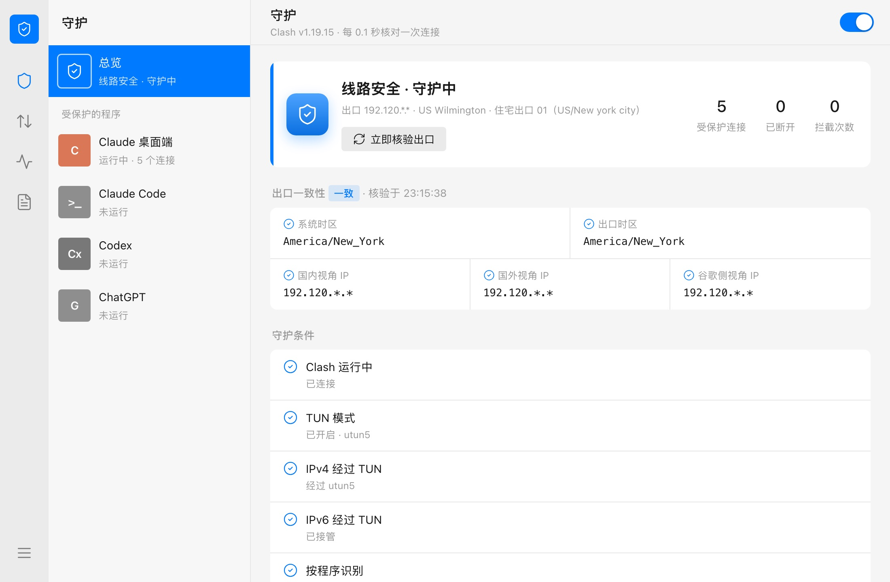
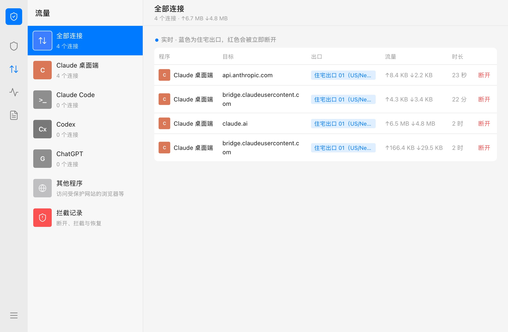
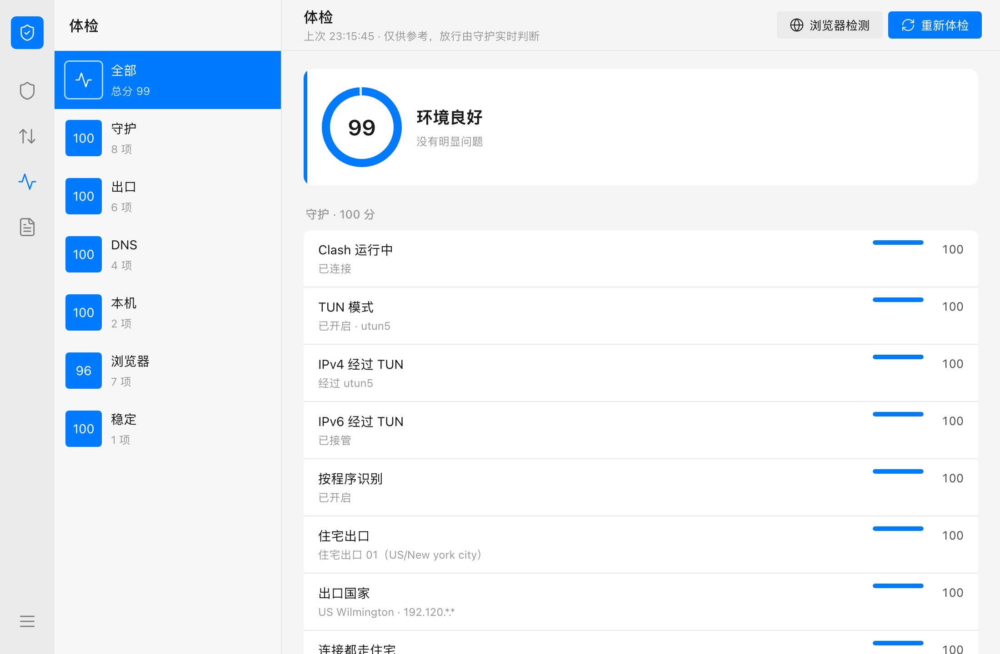
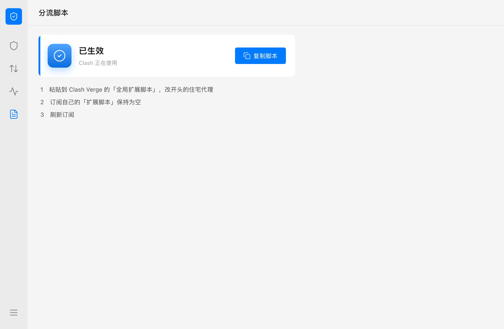
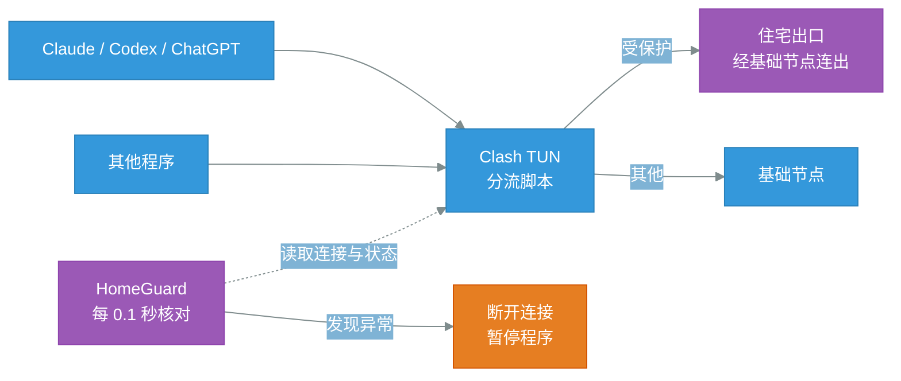

<p align="center">
  
  
  
  
  <a href="https://linux.do"></a>
</p>

# HomeGuard

让 Claude、Codex、ChatGPT 的流量**只从住宅出口出去**：一旦有连接没走住宅 IP，立即断开，并暂停这些程序，线路恢复后自动继续。

核心目标是**实时守护，环境存在异常时立即断开并暂停程序**。

> 基于 [zzusec/CheckClaude](https://github.com/zzusec/CheckClaude) 二次开发。


## 一、功能说明

| 页面 | 用途 |
| --- | --- |
| 守护 | 总状态、出口一致性、守护条件、各程序的进程与连接、最近记录 |
| 流量 | 受保护程序的实时连接，蓝色为住宅出口，可手动断开；拦截记录 |
| 体检 | 出口、DNS、本机、浏览器、出口稳定性打分【仅供参考】 |
| 分流脚本 | 一键复制 Clash 全局扩展脚本，并检查是否已经生效 |
| 设置 | 守护开关、拦截时是否暂停程序、受保护的程序与网站、Clash 连接（连不上时自动查找控制接口） |

**出口一致性**：系统时区、出口时区，以及国内、国外、谷歌侧三个视角看到的出口 IP。

**浏览器检测**：在默认浏览器里检测 WebRTC 泄露、浏览器时区与语言、区域、渲染器、平台，结果并入体检。首次使用做一次即可，不参与拦截。

**默认受保护的程序**：Claude 桌面端、Claude Code、Codex（CLI 与桌面端）、ChatGPT 桌面端。默认受保护的网站：Anthropic、Claude、OpenAI、ChatGPT。都可以在设置里改。

关闭窗口后守护仍在后台运行，在「设置 → 关于」里退出。

### 界面

**守护总览**：线路状态、出口一致性、守护条件



**流量**：受保护程序的实时连接与出口



**体检**：分组打分，含浏览器侧检测



**分流脚本**：一键复制，显示是否已生效




## 二、工作流程



两道防线：

- **分流脚本（零延迟）**：Clash 按程序路径和域名，把受保护的流量只送到「住宅出口」，其他流量走「基础节点」；
- **实时守护**：通过 Clash 控制接口每 0.1 秒核对全部连接，路由一变化立即检查。下面任一项不满足，就断开全部受保护的连接并暂停程序（SIGSTOP，暂停后不收发任何数据）：
  - Clash 运行中、TUN 开启，IPv4 与 IPv6 都经过 TUN；
  - Clash 开启了按程序识别；
  - 「住宅出口」选的是住宅代理，不是机场节点或直连；
  - 出口国家在 Claude 服务范围内；
  - 没有受保护的连接走了别的出口。出现这种情况会锁定拦截，确认处理后手动恢复。

分流脚本同时处理了防泄露：DNS 查询全程加密并按规则走代理，IPv6 由 TUN 接管，只有本机、局域网、Tailscale 组网内部不经过代理。

### 拦截的时效

正常情况下，受保护的流量只能走住宅出口，不存在空档。只有规则被破坏时（「住宅出口」被切走、规则被别的配置覆盖、TUN 被关），才会有连接走错路：

- **守护最迟 0.1 秒内断开它**。连上目标后还要完成加密握手，程序才发出带账号信息的请求，实测这段间隔为 300～700 毫秒，所以一般断在请求发出之前；
- **TUN 被关时**流量不经过 Clash，连接断不了，改为路由一变化就暂停程序，几十毫秒内生效。

### 手动切换出口

两个分组都留了一个手动退路，默认不选中：「住宅出口」可退到「基础节点」，「基础节点」可退到直连（会暴露真实 IP）。

不使用 AI 应用时，可以把「住宅出口」切到「基础节点」降低谷歌等网站的延迟。切换期间守护会暂停正在运行的受保护程序，切回后自动恢复；如果切换期间有受保护的连接走了别的出口，需要在守护页手动恢复。


## 三、安装、依赖和使用

### 依赖环境

| 用途 | 需要什么 |
| --- | --- |
| 运行 | macOS 11+，Clash Verge（mihomo 内核）开着 TUN 与 IPv6，关闭「DNS 覆写」 |
| 构建 | Go 1.26，Xcode 命令行工具（窗口用到 cgo） |


### 安装

```bash
scripts/package-mac.sh --install
```

打包到 `dist/HomeGuard.app` 并安装到「应用程序」。本机签名，未做公证。


### 使用

1. 打开 HomeGuard，进入「分流脚本」，点「复制脚本」；
2. 粘贴到 Clash Verge 的「全局扩展脚本」，填写自己的住宅代理；
3. 订阅自己的「扩展脚本」保持为空，否则会覆盖全局脚本的规则；
4. 刷新订阅，在 Clash 里选好「基础节点」和「住宅出口」；
5. 回到「分流脚本」确认显示「已生效」。

命令行：

```bash
/Applications/HomeGuard.app/Contents/MacOS/homeguard status   # 查看状态
/Applications/HomeGuard.app/Contents/MacOS/homeguard quit     # 退出守护，继续被暂停的程序
```

数据目录：`~/Library/Application Support/HomeGuard`。


## 四、社区友链

[LINUX DO](https://linux.do/)：一个关注开发者、开源项目与 AI 工具交流的社区。感谢社区佬友对开源工具和 Agent 工作流的讨论与反馈。


## 五、许可与致谢

MIT 协议，见 [LICENSE](LICENSE)。

本项目基于 [zzusec/CheckClaude](https://github.com/zzusec/CheckClaude) 二次开发。

原项目功能：跨平台环境体检、26 项加权打分、三路出口一致性、一键修复时区与 DNS；

本项目新增功能：实时守护与拦截、Clash 分流脚本、多程序保护、桌面窗口。

分数与守护结果只反映本机网络与环境状态，不代表 Anthropic 的官方判定，也不构成账号安全保证。
